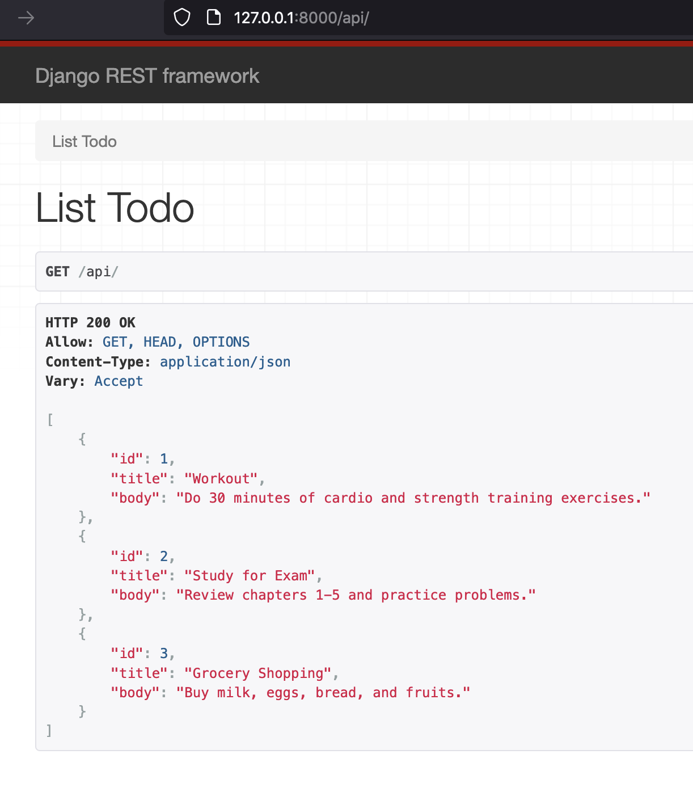
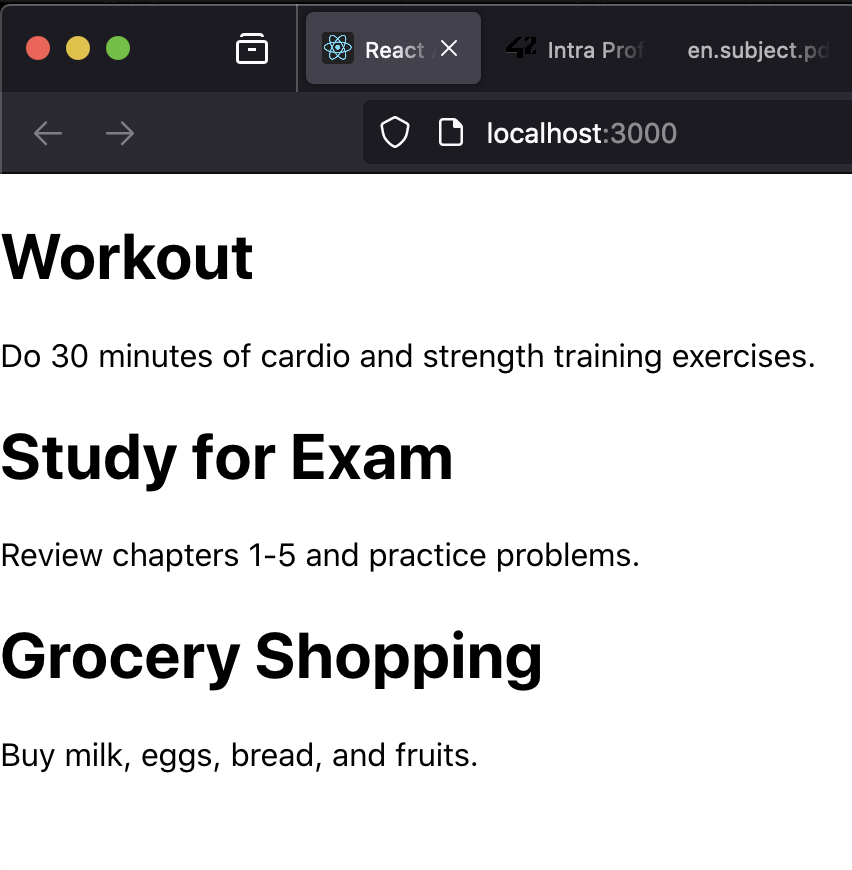
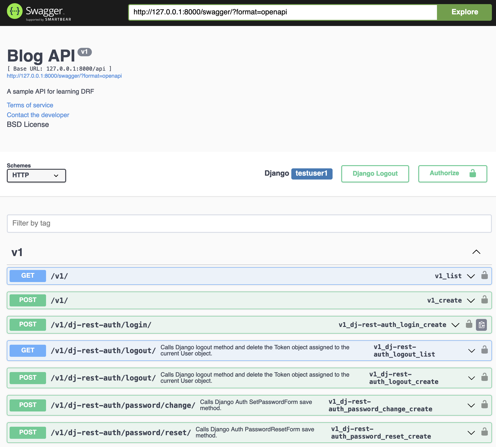
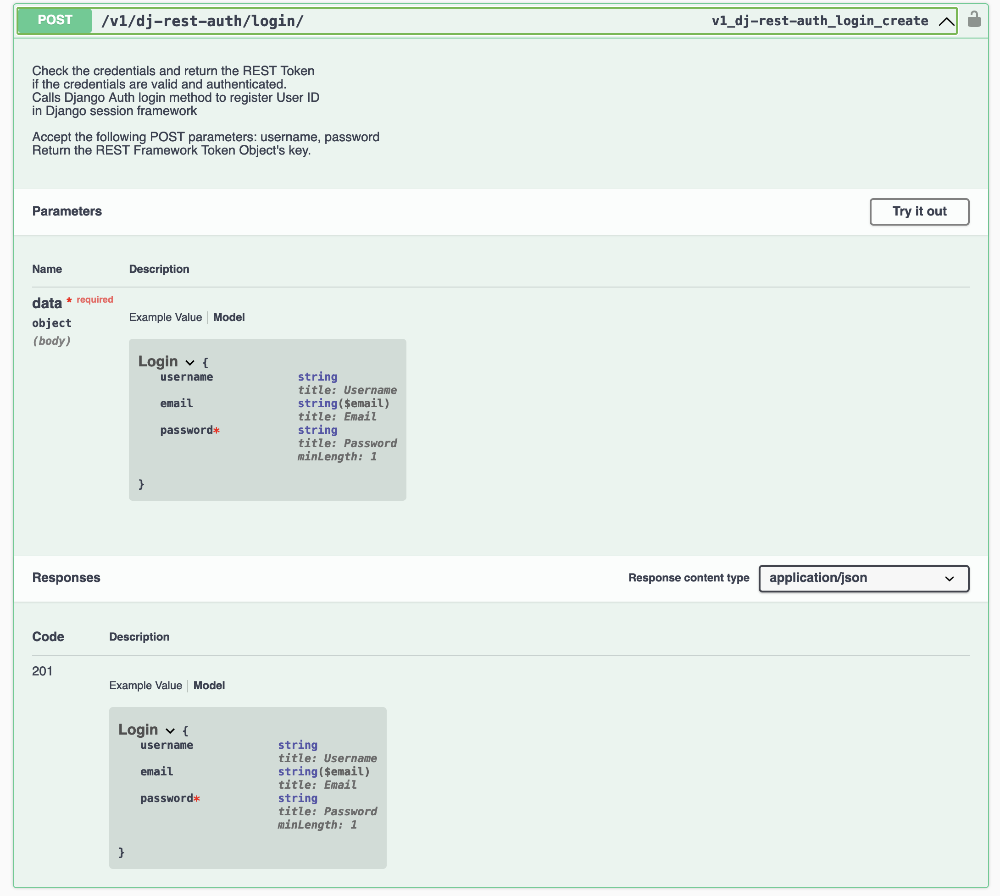

## Django for APIs Project Repository

This repository contains learning projects based on the book "Django for APIs" by William S. Vincent. It includes a Todo API and a Blog API, demonstrating practical applications of Django REST Framework, User Authentication, Viewsets, Routers, Schemas, and Documentation.

### Todo API
The Todo API project is a full-stack application built with Django, Django REST Framework, and React. It covers topics such as models, serializers, views, and API consumption using Axios in the React frontend.

  
   

### Blog API

The Blog API project is a comprehensive demonstration of various advanced Django REST Framework concepts. It starts with the initial setup of the API, creation of models, and writing tests. It then delves into the creation of Django REST Framework URLs, serializers, and views. The project also covers the use of the browsable API.

The subsequent chapters explore more advanced topics such as permissions, user authentication, viewsets, routers, schemas, and documentation. Each topic is explained with practical examples and visualized using Swagger UI.

  
   

### Resources:
- [Django for APIs Book](https://djangoforapis.com/)